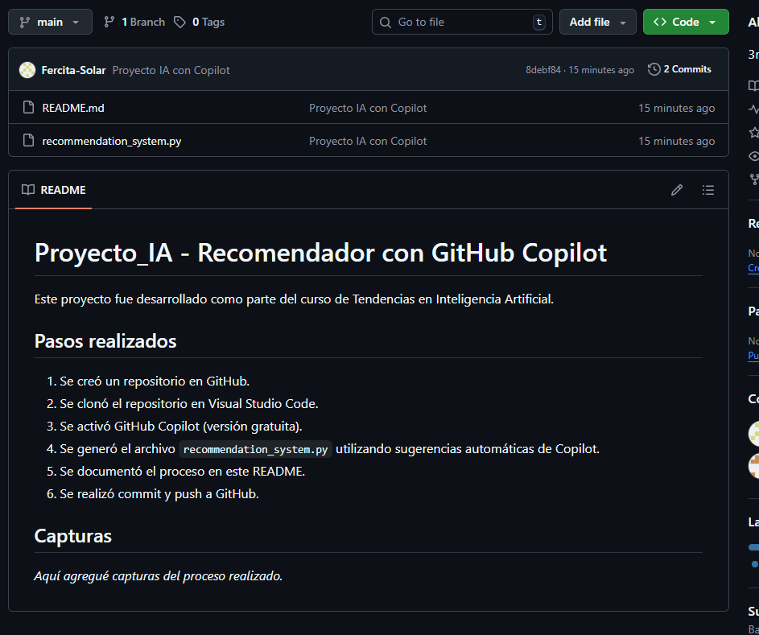
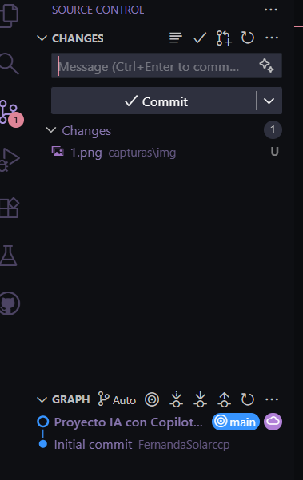
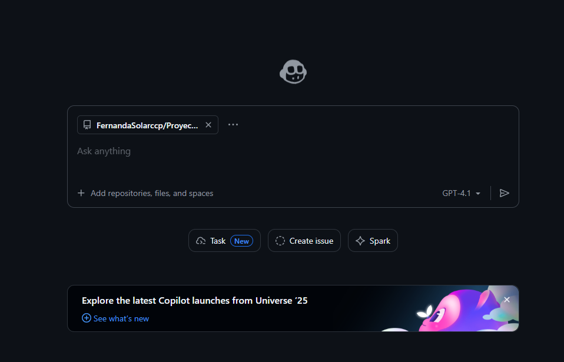
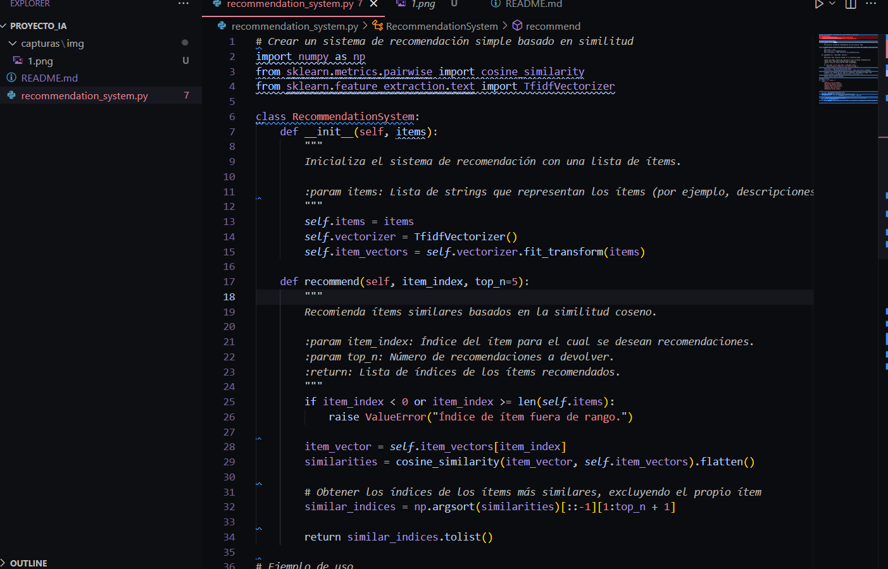
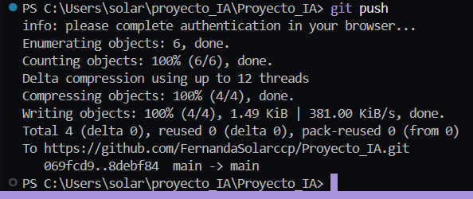

# Proyecto_IA - Recomendador con GitHub Copilot

Este proyecto fue desarrollado como parte del curso de Tendencias en Inteligencia Artificial.

## Pasos realizados

1. Se creó un repositorio en GitHub.
2. Se clonó el repositorio en Visual Studio Code.
3. Se activó GitHub Copilot (versión gratuita).
4. Se generó el archivo `recommendation_system.py` utilizando sugerencias automáticas de Copilot.
5. Se documentó el proceso en este README.
6. Se realizó commit y push a GitHub.

## Capturas
*Aquí agregué capturas del proceso realizado.*

## Capturas

1. **Repositorio creado en GitHub**
   
   

2. **Repo clonado en VS Code**
   
   

3. **Copilot activo (versión gratuita)**
   
   

4. **Archivo `recommendation_system.py` generado con sugerencias de Copilot**
   
   

5. **Commit y push desde VS Code / Terminal**
   
   
